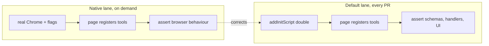

# Card 42: WebMCP Tools (Testing an Agent-Ready Page)

The portable agent skill for this pattern is `playwright-webmcp`.

## What This Pattern Solves

[WebMCP](https://github.com/webmachinelearning/webmcp) lets a page hand an agent a set of callable tools. Your page calls `document.modelContext.registerTool()`, and the browser advertises those tools to whatever agent is driving. The page stops being something an agent has to read pixel by pixel and becomes something it can call.

That creates a surface you have to test. Your tool schemas are an API contract now, and a wrong `enum` or a missing `required` sends the agent down a path your buttons never allow. Two problems make it awkward:

1. Bundled Chromium has no WebMCP, so your everyday suite cannot see the API at all.
2. Chrome ships it behind flags on a moving draft, so a suite pinned to today's behaviour goes stale without telling you.

This card runs two lanes to cover both.

## The Two Lanes

| Lane | Browser | Runs | Proves |
|------|---------|------|--------|
| default | bundled Chromium, `document.modelContext` test double | every `pnpm test` | your page's tools: schemas, handlers, and the state they share with the UI |
| native | real Chrome with the flags on | on demand | the double still matches the browser |

The default lane is where you spend your time. It runs anywhere, needs no special browser, and tests the thing you actually wrote. The native lane exists to stop the double drifting into fiction.

Building this card proved the point. The double returned a throwing handler's message as text, copied from a WebMCP library that catches errors and does exactly that. Real Chrome rejects instead. The native lane caught it on the first run, and both lanes now assert what Chrome measurably does.

## How It Works

**The page** (`apps/web/src/pages/webmcp.astro`) registers `add_to_cart` and `get_cart` against the same cart its buttons drive, then feature-detects so it still works in a browser without WebMCP.

**The double** (`webmcp-fixture.ts`) installs `document.modelContext` through `page.addInitScript()`, which runs before any page script. It exports a `test` with the double already on `page`.

**The native lane** (`webmcp-native.contract.ts`) drives real Chrome through `playwright-webmcp-native.config.ts`. Files end in `.contract.ts` so the default `pnpm test` skips them.

## Code Example

Drive a tool the way an agent would, then assert on what the user sees:

```typescript
import { test, expect } from './webmcp-fixture';

test('an agent calling a tool changes what the user sees', async ({ page }) => {
  await page.goto('/webmcp');

  const result = await page.evaluate(async () => {
    const [addToCart] = await document.modelContext!.getTools();
    return document.modelContext!.executeTool!(
      addToCart!,
      JSON.stringify({ sku: 'espresso', qty: 2 }),
    );
  });

  expect(JSON.parse(result)).toMatchObject({ sku: 'espresso', qty: 2 });
  await expect(page.getByTestId('cart-count')).toHaveText('2');
});
```

The second assertion carries the weight. A tool that reports success while the cart stays empty has given the agent a lie, and only the UI check catches it.

## What Chrome Actually Does

Measured against Chrome 152.0.7977.65, not taken from the draft:

| Behaviour | What Chrome does |
|-----------|------------------|
| `getTools()` order | sorted by name, ignoring registration order |
| `inputSchema` on a descriptor | a JSON **string**, so parse before asserting |
| `executeTool(tool, input)` | `input` must be a JSON string; an object rejects with `UnknownError` |
| handler returns an object | serialised, so `{a:1}` arrives as `'{"a":1}'` |
| handler returns `undefined` | arrives as the string `"undefined"` |
| handler throws | the call **rejects** with `UnknownError`, and the message is replaced by a generic one |
| duplicate tool name | `InvalidStateError` |
| `AbortSignal` on registration | aborting withdraws the tool |

The throwing case is the one that bites. Your agent never sees why the call failed, so wrap the handler yourself if the reason matters:

```typescript
execute: (input) => {
  try {
    return JSON.stringify(addToCart(input.sku, input.qty ?? 1));
  } catch (error) {
    return `Could not add that item: ${error.message}`;
  }
}
```

## Run This Example

```bash
pnpm test:webmcp            # default lane, no special browser
pnpm test:webmcp:native     # native lane, needs a Chrome with WebMCP
```

For the native lane, point `CHROME_BIN` at a Chrome that ships WebMCP if the default search misses yours:

```bash
CHROME_BIN="/Applications/Google Chrome Canary.app/Contents/MacOS/Google Chrome Canary" \
  pnpm test:webmcp:native
```

The config launches it with `--enable-experimental-web-platform-features` and `--enable-features=WebMCPTesting,DevToolsWebMCPSupport`.

## Two Traps Worth Knowing

**A `data:` URL has no WebMCP.** Its origin is opaque, and `document.modelContext` is absent there in a browser that exposes it on every real page. Probe on `http://localhost`, or you will conclude the feature is missing when it is not. This cost an hour while building the card.

**Version checks lie.** `>= 152` passes on builds that have no API, and fails on a future build that renames nothing. Ask the browser directly:

```typescript
const available = await page.evaluate(
  () => typeof document.modelContext?.registerTool === 'function',
);
test.skip(!available, 'This Chrome exposes no document.modelContext');
```

Feature-detect `executeTool` separately. It is a Chromium preview extension rather than WebMCP core, so a conformant browser may not have it.

## Prerequisites

- **Card 21**: App Driver Fixture, for the fixture pattern the double uses.
- **Card 02**: Mock First API, for why a controlled boundary beats a real one in the everyday lane.

## Key Concepts

- **The page owns one state.** Tools and buttons write to the same cart, so an agent and a user cannot disagree about what is in it. Assert both.
- **Schemas are the contract.** `required` and `enum` are what the agent reads to build a call, so test them like an API response.
- **The double is a claim.** It says "this is what Chrome does". The native lane is what makes the claim checkable.
- **Feature-detect twice.** Once for `modelContext`, once for `executeTool`.

## When to Use This Pattern

- ✓ Your page registers WebMCP tools and you want their schemas covered.
- ✓ You need the everyday suite green on a machine with no flagged Chrome.
- ✗ You are testing an agent's reasoning about your tools. That needs the agent, not Playwright.

## Common Mistakes

1. **Treating `inputSchema` as an object.** It is a JSON string. `schema.properties` on the raw descriptor is `undefined`, and the test passes for the wrong reason.
2. **Expecting a thrown message to reach the agent.** The call rejects and the message is dropped.
3. **Letting `executablePath: undefined` through.** Playwright falls back to bundled Chromium, and the failure reads as a missing API rather than a missing browser. `requireChrome()` throws instead.
4. **Registering tools before the page is ready.** `addInitScript` runs before page scripts, which is what makes the double work. Reverse the order and the page finds nothing.
5. **Running the native lane in CI by default.** It needs a browser most runners lack. Keep it on demand.

## Flow Diagram



## Related Patterns

- **Previous**: Card 41 (Type-Safe i18n)
- **Uses**: Card 21 (App Driver Fixture), the same fixture-extension shape
- **Documents**: Card 38 (Executable Stories), which turns these runs into readable docs
